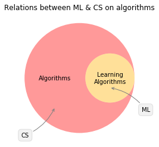
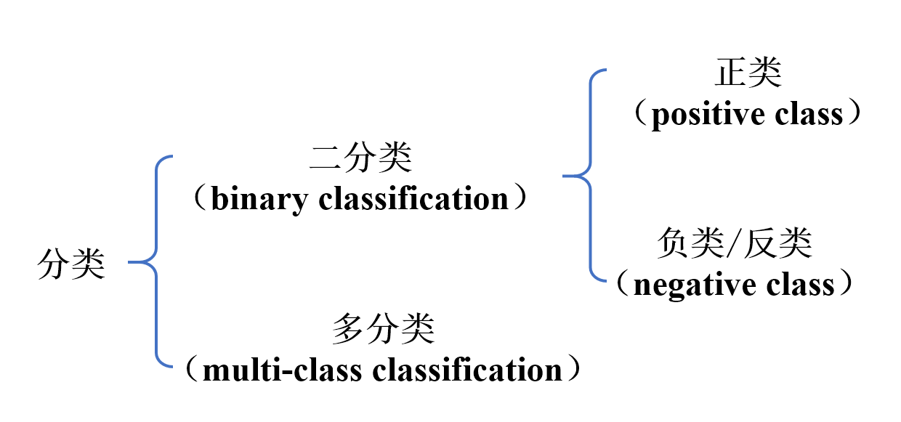
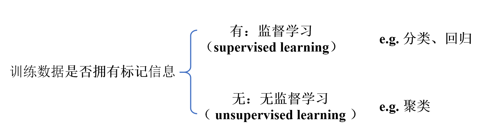
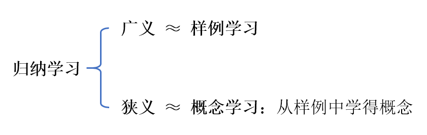
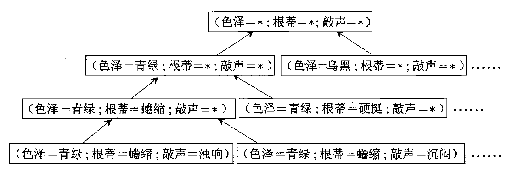
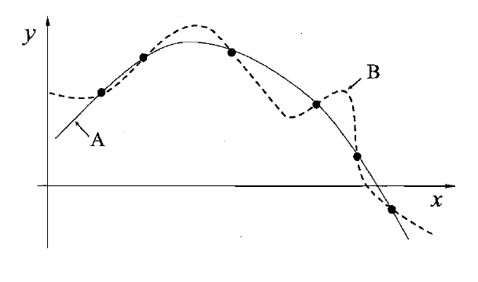

# Week 1 Notes

注记：作为一个对于ML，CV，py，jupyter，markdown，LaTeX都是纯小白的人，以及第一周的学习还被毕业设计和某算法课程的大论文拖着，属实难顶。所以在大概花了一天左右的时间研究了以下，决定先用jupyter+markdown这样混合的方式来完成自己的读书笔记。我一直是有这样的边读书边做整理做blog的习惯的（尤其在时间相对充裕准备吃透某些科目的时候），也在知乎上写过关于大数定理的文章，当时就感受到了用word写敲公式的痛苦，尤其是当时必须把MathType公式转化为LaTeX再复制到知乎上才算是可以编辑，所以这几个月的笔记肯定是不能再用word了；但是我也深知上手LaTeX需要一定的时间，权宜之计就只能先用这种jupyter+markdown的方式完成第一周的记录了。如果后期需要，可以再按照实验室的要求进一步调整和学习。

本周学习内容：ML C1、C2

## ML C1 绪论

第一章的内容总的来讲还是做一个引入，讲解了许多基础概念和ML的分类、诸多研究分支等，比较繁琐，所以决定总结一下诸多概念，并学习一下markdown的排版使用。

### 1.1 引言
* ML与CS的关系
  - **机器学习**：通过**计算（学习算法）**，利用**经验（数据）**，改善系统自身性能
  - **学习算法**：计算机从数据中产生**“模型”**的算法
* 模型 vs 模式：模型一般指全局性结果，模式指局部性结果

### 1.2 基本术语
* 数据集、记录
  - **数据集（data set）**：一组记录的集合，一般用$\cal D=\{x_1, x_2,..., x_m\}$表示
  - **记录/示例（instance）/样本（sample）**：关于一个事件或对象的描述
   从属性空间考察，也叫**特征向量（feature vector）**
   一般用${\bf x}_i=(x_{i1};x_{i2};...;x_{id})$表示（注意，是分号，表示列向量）
   其中$x_{ij}$表示第$x_i$（第i个示例）的第j个属性，d称为**维数（dimensionality）**
* 属性、属性值、属性空间
  - **属性（attribute）**：也叫特征（feature），事物或对象在某方面的表现或性质
  - **属性值（attribute value）**：属性的取值
  - **属性空间（attribute space）**：也叫**特征空间（feature space）**，属性张成的空间
* 学习（训练）、学得模型、真相
  - **学习(learning)/训练(training)**：从数据中学得模型的过程，找出、或让“假设”逼近“真相”
  - **学得模型/假设（hypothesis）/学习器（learner）**：学得模型对应的数据规律
  - **真相/真实（ground-truth）**：这种潜在规律自身
* 训练数据、训练样本、训练集
  - **训练数据（training data）**：训练过程使用的数据
  - **训练样本（training sample）**：训练数据中的每个样本
  - **训练集（training set）**：训练样本组成的集合，一般记为$\{({\bf x}_1, y_1), ({\bf x}_2, y_2),..., ({\bf x}_m, y_m)\}$
   $\color{red}{（所以训练集≈训练数据？我看还有什么测试集，是不是训练数据包含训练集）}$
* 标记、样例、标记空间
  - **标记（label）**：某一种示例的结果 $\color{red}{（书注中为什么说还有作动词意，有什么动词用法？）}$
  - **样例（example）**：拥有了label的示例，就成为了样例，一般记作$({\bf x}_i, y_i)$
  - **标记空间（label space）/输出空间**：即所有标记的集合
* 分类、回归
  - **分类（classification）**：预测离散值（如好瓜、坏瓜），此类任务称为分类
  - **二分类、多分类、正类、负类**:

 通常，对于二分类任务，$\cal Y = \{-1, +1\}~or~\{0, 1\}$
  - **回归（regression）**：预测连续值（如好瓜程度0.97、0.35等），此类任务称为回归
* 预测、测试、测试样本
  - **预测**：通过对训练集进行学习
  - **测试（testing）**：学得模型后，使用其预测的过程
  - **测试样本/测试示例（testing sample/instance）**：被预测的样本
* 聚类、簇
  - **聚类（clustering）**：聚类是一种操作，将训练集中的样本做划分
  - **簇（cluster）**：划分的每一组称为簇，这种簇可能对应一些潜在的概念划分
  
$\color{#FF3030}{（这里不太理解，这种划分是在训练前还是训练过程中？既然没有标记信息又谈何训练？\\还是说当只拿到样本而拿不到样例时，就只能做聚类作为一种权宜之计？）}$

* 监督学习、无监督学习
$$
训练数据是否拥有标记信息

### 1.3 假设空间
* 泛化、特化
  - **泛化能力**：学得模型适用于新样本（未见示例）的能力
   一般而言，$i.i.d.$采样越多，我们得到关于未知分布$\cal D$的信息越多，泛化能力越强
  - **泛化（generalization）**：从特殊到一般，对应科学推理的**归纳（induction）**
  - **特化（specialization）**：从一般到特殊，对应科学推理的**演绎（deduction）**
* 归纳学习

* Case Study
  - 本节并未给出假设空间的严格定义，可以认为是“所有假设构成的空间”，用Case Study去理解此节

 如：色泽、根蒂、敲声这三种属性，分别有三种可能取值，则假设空间规模为$4\times4\times4+1=65$
 注意通配符$*$和空集$\phi$
 假设的表示一旦确定，假设空间及其规模大小就确定了
* 版本空间
  - 版本空间（version space）：一个与训练集一致的“假设集合”
   $\color{red}{（这是是指训练集覆盖了全部假设空间，还是说版本空间只是训练集对应的，如果是后者，版本空间有什么用？）}$

### 1.4 归纳偏好
**归纳偏好（inductive bias）**：机器学习算法在学习过程中对某种类型假设的偏好
 理解：归纳偏好没有对错之分，只是模型之间势必会对结果产生差异
 直观理解：回归学习

* 奥卡姆剃刀
  - **奥卡姆剃刀（Occam's razor）**：若有多个假设与观察一致，则选最简单的那个
   并非唯一可行的原则，并且奥卡姆剃刀本身也存在不同的诠释
* 算法的归纳偏好是否与问题本身匹配，大多数时候直接决定了算法能否取得好的性能
* NFL定理
  - **没有免费的午餐（No Free Lunch Theorem，NFL）**：总误差与学习算法无关，所有学习算法的期望性能相同
 理解：NFL定理的前提条件比较严苛，它要求均布，即所有“问题”出现的机会相同、或所有问题同等重要
 因而NFL可能没什么实际意义，但应该认识到，脱离具体问题空谈什么算法好是无意义的，要具体问题具体分析
 Again，**归纳偏好与问题是否相匹配，往往会起到决定性的作用**

### 1.5 发展历程
* **推理期（20世纪50年代~70年代）**
 只要赋予机器逻辑推理能力，机器就能具有智能
* **知识期（20世纪70年代中期）**
 E.A.Feigenbaum等：要是机器具有智能，就必须设法使机器拥有知识
 但逐渐遇到了“知识工程瓶颈”，从输入知识 转变为 要让机器自己学习知识
* **百花初绽时期（20世纪80年代前）**
  - 基于神经网络的“连接主义”学习：F.Rosenblatt的“感知机”、B.Widrow的“Adaline”等
  - 基于逻辑表示的“符号主义”学习：P.Winston的“结构学习系统”等
  - 决策理论为基础的学习技术、强化学习等：N.J.Nilson的“学习机器”等
  - 统计学习理论：奠基性结果，刚开始火
* **学习期（20世纪80年代至今）**
  - 符号主义学习（20世纪80年代初期）占据主流，包括决策树（基于信息论）和基于逻辑的学习（如ILP）
  - 连接主义学习（20世纪90年代中期前）占据主流，基于神经网络，TSP问题、BP算法等一炮走红
   但产生的是黑箱模型，且局限在于“试错性”，需要参数调节，显得比较“玄学”
  - 统计学习（20世纪90年代中期后）闪亮登场，SVM、核方法等，逐渐成为了机器学习的基本内容之一
  - 连接主义学习（21世纪初）卷土重来，得益于大数据，深度学习等方式得到了很好的发展

### 1.6 应用现状、阅读材料（略）

 
